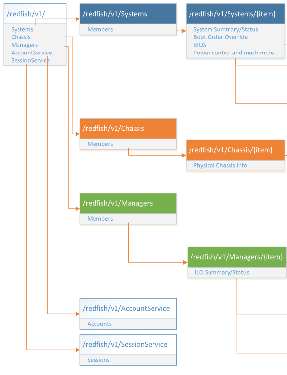

# Python and Redfish Lab Contents
This lab purpose is to explore Redfish and become more familiar with the standard as well as how to interact with it using the python programming language

## Lab Writers and Trainers
  - Bruno.Cornec@hpe.com

Based on work from
  - Francois.Donze@hpe.com
  - Rene@flossita.org

<!--- [comment]: # Table of Content to be added --->

## Objectives of the Python Redfish Lab
At the end of the Lab students should be able to navigate through the various Refish fields, understand the differences between what is in the standard and the possible OEM additions, use existing python based tools to control servers equiped with such a standard and program themselves a client in python using existing libraries.

This Lab is intended to be trial and error so that during the session students should understand really what is behind the environment, instead of blindly following instructions, which never teach people anything IMHO. You've been warned ;-)

Expected duration : 120 minutes

## Prerequisite knowledge

Attendees must be familiar with the following technologies:
  - **HTTP** basics
  - **Linux commands** and utilities
  - The **vi** or **nano** editors
  - Basic scripting (in **Python** being a plus)

Of course, in case you're less familiar with these technologies, the Lab is still doable, just ask for help to your instructors in order to avoid being stuck on a related topic.

## Reference documents

This lab intends to be a **complement** (not a substitute) to the following public documents:
  - [Redfish DMTF Web site](http://redfish.dmtf.org/)
  - [HPE RESTFul API](https://developer.hpe.com/platform/ilo-restful-api/home)
  - [HPE RESTful API Reference doc](https://hewlettpackard.github.io/ilo-rest-api-docs/)
  - [Managing HPE Servers Using the HPE RESTful API](http://h20564.www2.hpe.com/hpsc/doc/public/display?docId=c04423967)
  - [HPE RESTful Interface Tool](http://www8.hp.com/us/en/products/server-software/product-detail.html?oid=7630408)
  - [HPE RESTful API overview video](https://www.youtube.com/watch?v=0OjD2lHNWUU)
  - [Redfish: the new standard for a Software Defined Infrastructure ](https://fosdem.org/2019/schedule/event/redfish_the_new_standard_for_a_software_defined_infrastructure/) with presentation and video.

When dealing with the Redfish standard, the first approach is to look at the reference Web site http://redfish.dmtf.org/ 

Estimated time for the lab is placed in front of each part.

# Environment setup
Estimated time: 5 minutes

This Lab supposes that your client machine will run a Windows OS. If you're lucky to have a Linux one, don't worry as the instructions also apply to it as well.

Before starting the lab exercises, your client station must be installed with the following:
  1. An SSH client ([PuTTY](http://www.chiark.greenend.org.uk/~sgtatham/putty/download.html) on Windows clients is OK)
  2. An HTTP client ([Firefox](http://mozilla.org) on all clients is OK)

For the rest of this Lab, each team has received a lab number (**XX**) from the instructor, and we'll refer to your server as **labXX**. It's IP will be provided by the instructor, and the port to use to connect to it with ssh is 22XX (example 2201 for Lab 01). You'll have to log on it using the **redfish** account with the password Redfish@TSS19

Test the access to your OS (a preinstalled CentOS 7 Linux distribution). 
Answer Yes to the confirmation query.
If the login is successful, exit from the system:

`#` **`exit`**

# REST and Redfish introduction
Estimated time: 5 minutes

## REST definition

Wikipedia says: “Representational State Transfer (REST) is a software architecture style consisting of guidelines [...] for creating scalable web services [...] REST [is] a simpler alternative to SOAP and WSDL-based web services.

RESTful systems typically, but not always communicate over the Hypertext Transfer Protocol with the same verbs (GET, POST, PUT, DELETE...) used by web browsers...”

## Redfish definition

Wikipedia says: “The Redfish standard is a suite of specifications that deliver an industry standard protocol providing Software Defined Management for Converged infrastructure.”

Different hardware manufacturers may implement parts or totality of the standard, and for additional information they want to manage, they have an Oem entrypoint in the schema allowing them to manage these. 

This hands on lab focuses on the standard Redfish implementation but may mention when extensions are needed or unavoidable. In order to minimize manufacturer aspetcs, we'll work mostly with simulators that implement the standard.

## Web browser and REST client

Although REST is primarily used via Application Programming Interfaces (APIs), it is possible to test and debug RESTful systems with a web browser and an associated extension. The extension is used to build the correct https packets (headers, payload...) and to display nicely (or not) returned answers in different formats (JSON, XML, raw...). 

If you need to use a browser different from Firefox or Chrome, make sure its associated extension supports the PATCH verb/method, in addition to GET and POST. The PATCH method is a proposed standard (RFC 5789) and is required by the redfish specifications.

Now that your setup and some introduction has been done, let's start experimenting with Redfish.

# Discovering Redfish
Estimated time: 10 minutes.

## Using the DMTF mockups

The goal of this exercise is to understand the schemas provided by the standard and the various information one can retrieve from a Redfish managed system.

If you go to the Redfish DMTF mockups provided online at https://redfish.dmtf.org/redfish/v1, you'll be able to nativate using Redfish on different type of systems. Try first the [Simple Rack-mounted Server](https://redfish.dmtf.org/redfish/mockups/v1/863) and explore the 3 main entry points that will be relevant for this lab: [Systems](https://redfish.dmtf.org/redfish/mockups/v1/863#Systems), [Chassis](https://redfish.dmtf.org/redfish/mockups/v1/863#Chassis) and [Managers](https://redfish.dmtf.org/redfish/mockups/v1/863#Managers).

In this case (a traditional rack or blade server), the Total number of “Systems” contained in the Members array is 1. Compare this with what you get when parsing the [Systems](https://redfish.dmtf.org/redfish/mockups/v1/862#Systems) entrypoint of a Blade Chassis.

On a real system, to view the properties related to item 1 of this System, you would need to use the following URL: **https://IP/redfish/v1/Systems/1**

The exhaustive list of properties is returned, including various BIOS configuration items (BIOS version, SKU, Part/Asset/Serial #, Status, Boot order, inventory for CPU, RAM, ...), an Oem section to provide additional non-standardized information, links to other related components (Chassis, Manager), possible actions like the different Reset possibilities (ResetType)

In addition to the Systems link, the data model proposes others entry points like Chassis and Managers.

A partial view of the data model is:



Navigate now through the [Chassis](https://redfish.dmtf.org/redfish/mockups/v1/863#Chassis) link. You should notice that the it contains physical properties of the server(s).

Perform a similar navigation in the [Managers](https://redfish.dmtf.org/redfish/mockups/v1/863#Managers) location. What is the type of content under Managers? Confirm your findings with the data model picture just above. Find the MAC address of the BMC.

Change mockup to look at differences when dealing with a [Bladed system](https://redfish.dmtf.org/redfish/mockups/v1/862), made of a chassis with multiple computers (look at how having an enclosure impacts the representation, find the MAC address of the enclosure management card)  or with a [Composable System](https://redfish.dmtf.org/redfish/mockups/v1/868) made of blocks of CPUs, memory and disks (look at the new Composition service in particular)

## Using the HPE iLO RESTful API Explorer

Now that you have a better understanding of the Redfish Data Model, let's see what it gives on real hardware. Point your browser to the [HPE iLO RESTful API Explorer](https://ilorestfulapiexplorer.ext.hpe.com/). Explore again and remark differences. As an example, look for the BIOS entry for the system and compare the list between the mockup of the [Simple Rack-mounted Server](https://redfish.dmtf.org/redfish/mockups/v1/863) and the real system.


## Using Command Line Interface tools

Using a Web browser to get and set properties in a server is very useful for learning or troubleshooting. However, browsing the data model becomes quickly complex. For a quick acces to information, you may want to use Command Line Interface based tools. Multiple possibilities exist here, either using generic tools to interact with the RESTful API, or more specific, very often written in python, aware of the Redfish data model.

### Using wget or curl

`wget` and `curl` are non-interactive CLI network downloaders available on Linux. They can be used to send https requests and perform actions via the Redfish API.

On your server, install `curl`: 

`#` **`yum install -y curl`**

Use it to walk through the Redfish data model on the public HPE simulator:

<!--- 
**`wget --header='OData-Version:4.0' --header='Content-Type:application/json' --no-check-certificate --auth-no-challenge --http-user=demopaq --http-password=password --post-data='{"Action":"Reset"}' https://10.3.222.10X/redfish/v1/Managers/1/`**

The above command uses a basic authentication (`--auth-no-challenge`) and does not require any certificate from the iLO (`--no-check-certificate`) and uses the usual `X` you need to change.

`Host#` **`curl --dump-header - --insecure -u demopaq:password --request PATCH -H "OData-Version: 4.0 " -H "Accept: application/json " -H "Content-Type: application/json " --data '{"Oem": { "Hp": { "HostName": "ilo-foobar" } } }' https://10.3.222.10X/redfish/v1/Managers/1/EthernetInterfaces/1/`**
--->

## Python SDK

The python language and its multiple web and security related modules provides a perfect eco-system for creating RESTful for iLO programs. 

The following python script is for didactic purposes only, and HPE does not support it. Use it with care. It requires python 2.7 or later. Sending low-level configuration commands can be dangerous to running systems and to avoid any problem, the user must understand what he does... NOTE: This version is not fully Redfish 1.0 compliant. A future version will be.

This python script contains several examples. We will explain how to run the first one and, if you have time, you will be able to run others. 

A version of this script is present in your environment, but later you can download the latest version of this file from: https://github.com/HewlettPackard/python-proliant-sdk

Once your Gen9 server is up and running, ssh/PuTTY to it as root (password) and cd /usr/kits. Using `nano` or the `vi` editor, edit the script:

`Host#` **`cd /usr/kits`**

Before launching the script, and for security reasons, you need to edit it with your favorite editor and perform at least three tasks. 

`Host#` **`vi HpRestfulApiExamplesExperimental.py –c 1889`**

Supply your iLO info around line 1889:
  1. `host = ’10.3.222.10X’`
  1. `iLO_loginname = ‘demopaq’`
  1. `iLO_password = ‘password’`

Comment out the `sys.exit` call around line 1902:
```
# sys.exit (-1)
```
Move the `if False:` directive below exercice1 and remove leading spaces of exercise1:
```
ex1_change_bios_setting(host, 'AdminName', 'Mr. Rest',... )
if False:
    ex2_reset_server(host, iLO_loginname, iLO_password)
    ex3_enable_secure_boot(host, False, iLO_loginname, iLO_password)
[...]
```
Save the file and exit.
Execute the script. It will modify the `AdminName` UEFI Bios parameter:

`Host#` **`python HpRestfulApiExamplesExperimental.py`**


Using the REST client Browser, verify that your modification is not yet in the BIOS, but still in the pending area of the BIOS. In BIOS, you should still read `"AdminName": "Foo Bar"`:


In the pending area, you should see your modification:


NOTE: The pending area of the BIOS will updated with your modification at next reboot.
Feel free to try other exercises and investigate how they have been implemented in this python script.

# Using python-redfish library.

Estimated time: 15 minutes

The python-redfish library is a reference implementation to enable Python developers to communicate with the [Redfish API](http://www.dmtf.org/standards/redfish).
The project is in it's infancy but already allows to retrieve information and perform few actions.
The goal of this project compared to HP SDK is to stick to the Redfish standard to allow compatibility between HW providers. So not to manage the oem proprietary part provided by HW company such as HPE (or only for exceptions).

The project also comes with a client in order to interact with Redfish and is mainly used to validate the library.

This is a full 100% Free and Open Source Software, under the Apache v2 license and contributions are welcome at https://github.com/bcornec/python-redfish ! :)

## Install the required repository

Install the python-redfish repository.

`#` **`cd /etc/yum.repos.d`**

`#` **`cat > python-redfish.repo << EOF`**
```
[python-redfish]
name=centos 7 x86_64 - python-redfish Vanilla Packages
baseurl=ftp://mondo.hpintelco.org/centos/7/x86_64
enabled=1
gpgcheck=1
gpgkey=ftp://mondo.hpintelco.org/centos/7/x86_64/python-redfish.pubkey

[python-redfish-test]
name=centos 7 x86_64 - python-redfish Vanilla Packages
baseurl=ftp://mondo.hpintelco.org/test/centos/7/x86_64
enabled=1
gpgcheck=1
gpgkey=ftp://mondo.hpintelco.org/centos/7/x86_64/python-redfish.pubkey
EOF
```

Install the EPEL repository.

`#` **`rpm -Uvh https://dl.fedoraproject.org/pub/epel/epel-release-latest-7.noarch.rpm`**

Fix some dependencies not provided by current rpm.

`#` **`yum install -y python-future python-pbr  # This is to fix some dep issues`**

Finally, install `python-redfish`.

`#` **`yum install -y python-redfish --nogpg`**

## Using the redfish-client

Launch the binary, it should provide the usage:

`#` **`redfish-client`**
```
Usage:
   redfish-client [options] config add <manager_name> <manager_url> [<login>] [<password>]
   redfish-client [options] config del <manager_name>
   redfish-client [options] config modify <manager_name> (manager_name | url | login | password) <changed_value>
   redfish-client [options] config show
   redfish-client [options] config showall
   redfish-client [options] manager getinfo [<manager_name>]
   redfish-client [options] chassis getinfo [<manager_name>]
   redfish-client [options] system getinfo [<manager_name>]
   redfish-client (-h | --help)
   redfish-client --version
```
Use the client to register a redfish manager.
Manager is the wording used to define a management interface such as an iLO for instance.

`#` **`redfish-client config add iloX https://10.3.222.10X/redfish/v1 demopaq password`**

`#` **`redfish-client config showall`**
```
Managers configured :
iloX
	Url : https://10.3.222.10X/redfish/v1
	Login : demopaq
	Password : password
```

Then retrieve manager data:

`#` **`redfish-client manager getinfo iloX`**
```
Gathering data from manager, please wait...

Connection error : [Errno 1] _ssl.c:504: error:14090086:SSL routines:SSL3_GET_SERVER_CERTIFICATE:certificate verify failed
1- Check if the url is the correct one
2- Check if your device is answering on the network
3- Check if your device has a valid trusted certificat
   You can use openssl to validate it using the command :
   openssl s_client -showcerts -connect <server>:443
4- Use option "--insecure" to connect without checking   certificate
```
It fails, because there is no certificate installed on the Ilo.

`#` **`redfish-client manager getinfo iloX --insecure`**
```
Gathering data from manager, please wait...

Redfish API version :  1.00
HP RESTful Root Service

Managers information :
======================

Manager id 1:
UUID : f240d59d-f156-56b7-9638-28a08615aa2f
Type : BMC
Firmware version : iLO 4 v2.40
Status : State :  / Health :
Ethernet Interface :
    Ethernet Interface id 1 :
    Manager Dedicated Network Interface
    FQDN : ilo-lab1.labossi.hpintelco.org
    Mac address : FC:15:B4:93:12:4C
    Address ipv4 : 10.3.222.101
    Address ipv6 : FE80::FE15:B4FF:FE93:124C
Managed Chassis :
	1
Managed System :
	1
----------------------------
```
Now retrieve system data:

`#` **`redfish-client system getinfo iloX --insecure`**
```
Gathering data from manager, please wait...

Redfish API version :  1.00
HP RESTful Root Service

Systems information :
=====================

System id 1:
UUID : 30373237-3632-5A43-3235-303231315947
Type : Physical
Manufacturer : HPE
Model : ProLiant BL460c Gen9
SKU : 727026-B21
Serial : CZ250211YG
Hostname : lab1
Bios version : I36 v2.00 (12/15/2015)
CPU number : 1
CPU model : Intel(R) Xeon(R) CPU E5-2609 v3 @ 1.90GHz
Available memory : 16 GB
Status : State : OK / Health : OK
Power : On
Description : Computer System View
Chassis : 1
Managers : 1
IndicatorLED : Off

Ethernet Interface :
    This system has no ethernet interface

Simple Storage :
    This system has no simple storage
--------------------------------------------------------------------------------
```
Enable debugging information:

`#` **`redfish-client system getinfo iloX --insecure --debug=3`**
```
[...]
Lots of debugging info !
[...]
```

## Using the python-redfish library directly

Use the client to register a redfish manager as default entry.

`#` **`redfish-client redfish-client config add default https://10.3.222.10X/redfish/v1 demopaq password`**

The library comes with a simple example called '`simple-proliant.py`' to use the library itself.

`#` **`cd /usr/share/doc/python-redfish-0.420160520014518`**

`#` **`more simple-proliant.py`**

For the moment, please comment all the lines containing '`set_parameters`'. Then you can run:

`#` **`python simple-proliant.py`**

Now you can look at the python code to get data and perform some actions. The library documentation is available at: http://pythonhosted.org/python-redfish. The classes are defined here: http://pythonhosted.org/python-redfish/python-redfish_lib.html.

You can then comment/uncomment and modify the code to experiment. e.g. below:

Retrieve manager bios version:
```
print(remote_mgmt.Systems.systems_dict["1"].get_bios_version())
```
Retrieve chassis manufacturer:
```
print(remote_mgmt.Chassis.chassis_dict["1"].get_manufacturer())
```
Print chassis type:
```
print(remote_mgmt.Chassis.chassis_dict["1"].get_type())
```

Uncommenting the following line should reboot the system:
```
# mySystem.reset_system()
```

## Conclusion

The iLO RESTful API provides a rich set of means to display and modify HPE ProLiant servers. And as usual there is more than one way to do it, even in python ;-)
